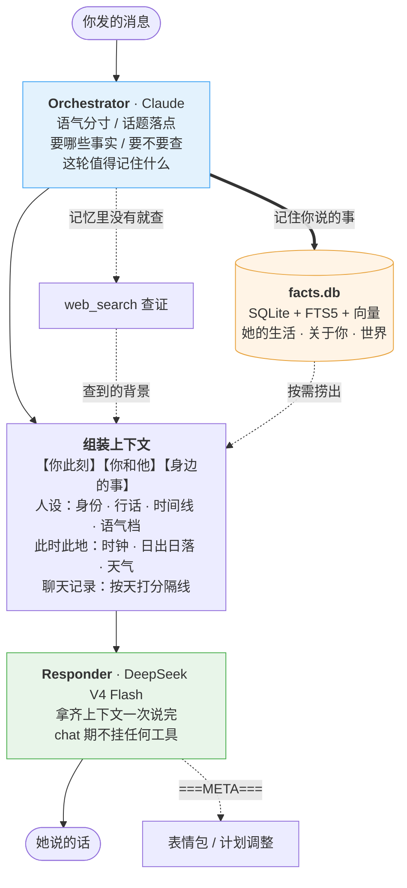
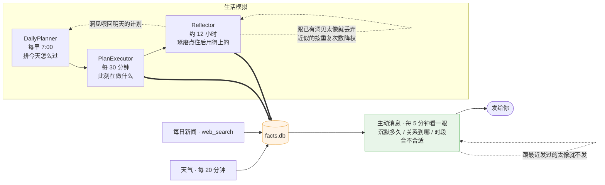

# 灵犀 / Lingxi

一个可定制人设的虚拟人格 agent。目标是**真实的对话体验**——不是应答机器人，而是一个有自己的生活、记忆和主观理解的"人"。

> 名字取自"心有灵犀"——无需言明，自然相通。

跟一般的角色扮演 bot 有三点不同：

- **她有自己的一天。** 后台每天给她排计划、推进成一件件"此刻在做什么"、隔段时间回看总结。她跟你说的事，是她当天真的在做的事。
- **记忆是唯一的状态。** 没有情绪标量、没有状态机。"她现在怎么样"就是她记忆流里最近发生的事——照 [Generative Agents](https://arxiv.org/abs/2304.03442) 那套做。
- **想事情和说话是两个模型。** 编排用 Claude，开口用中文母语模型单程生成。说话那一程不挂任何工具，语感不被打断。

## 它是什么样的

**她记得你。** 你几点下班、养了什么猫、在赶什么项目、约好了什么——说过一次就记住，下次直接用，不会再问一遍。关系随互动推进，轮数和了解量是硬门槛。

**她会主动找你。** 不是定时模板：素材来自她那天真的经历，感知你沉默多久、现在几点、这话该用什么音量。发之前查重，跟最近说过的太像就不发；被晾着的次数越多，下次开口隔得越久。

**她知道此时此地。** 真实时钟、按经纬度算的当地日出日落（冬天五点就黑）、实时天气。聊天记录按天打分隔线，四天前的事不会被当成昨天。

**她看得懂图，也会发表情包。** 图片进来先转成描述再进记忆，所以下一轮她还记得你发过什么；表情包按情绪语义检索。

**换个人设，她就是另一个人。** 身份、性格、说话风格、行话、传记全在 YAML 里，数据按人设各自独立，互不串线。

**接在哪都行。** 飞书机器人（流式卡片）、Web API、命令行，外加一个能感知你在写代码的桌面宠物。

## 快速开始

```bash
python3.12 -m venv .venv && source .venv/bin/activate
pip install -e ".[feishu,embeddings,vector-db]"   # Web API 加 api，桌宠加 pet

cp .env.example .env      # 填 key，见下
lingxi                    # 命令行先聊两句
```

`.env` 里除了人设都可以先留空——缺什么，启动日志会说：

| 变量 | 用途 |
|---|---|
| `PERSONA_PATH` | 她是谁。切这一行就换人，记忆跟着换 |
| `DEEPSEEK_API_KEY` | 对外说话的模型 |
| `ARK_API_KEY` + `EMBEDDING_MODEL` | 语义检索（火山方舟接入点 `ep-xxx`）。不填就退回关键词匹配 |
| `FEISHU_APP_ID` / `FEISHU_APP_SECRET` | 只有跑飞书机器人才需要 |

编排那一程走 Claude：会自动读本机 Claude Code 的登录态，没有就 `lingxi login anthropic`，或者设 `ANTHROPIC_API_KEY`。

其他入口：`lingxi-server`（Web API）、`lingxi-feishu`（飞书）、`lingxi-pet`（桌宠）。

## 做一个你自己的人设

`config/personas/example_persona.yaml` 是最小骨架，`tangkeke.yaml` 是写满了的样板——想看某个字段实际怎么写，看后者。改完把 `PERSONA_PATH` 指过去即可。

几个值得知道的字段：

- **`lexicon`**（顶层）— 她这行的行话。模型不知道自己不知道，不会主动去查，所以圈内缩写要当母语写进去，否则它按字面义理解（有人说"你都没给我 res"，模型当成要资源下载）。
- **`identity.birthdate` 和顶层 `anchors`** — 写日期，不写年龄。"今年几岁""出道几年了"按当天算，明年自己变。
- **`register_notes`**（顶层）— 同一个语气档在不同人身上长什么样。同样是"被戳到"，有人结巴，有人直球坐实；不写就用通用版，容易滑向刻板印象。
- **`message_habits`** — 打字习惯：断句、标点、一次发几条。
- **`location`** — 决定她的日出日落和天气。
- **`responder`** — 谁来说话（`deepseek` / `doubao` / `main`），模型 id 从 `.env` 读，不进仓库。

写 prompt 类字段时有条经验：**用正面例子，别列"不要做什么"**。大量的否定句会把注意力集中到你想避免的那个词上，反而更容易出现。

## 它怎么工作

编排脑先想清楚这轮该怎么接、要用哪些事实、要不要查证；说话那一程拿到齐备的上下文一次说完。



后台另有一条线一直在跑，主动消息的素材从这里来：



## 参与开发

```bash
pip install -e ".[dev,feishu,embeddings,vector-db,api]"
pytest -q          # 831 个测试，应当全绿
ruff check src
```

### 代码在哪

```
src/lingxi/
├── persona/       # 人设 YAML + 模型 + prompt builder
├── facts/         # 单一事实源：store(SQLite/FTS5/向量) + retriever + scorer + reflector
├── brain/         # orchestrator(调度脑) + renderer(渲染事实进 prompt) + retrieval(开口前联网)
├── conversation/  # 对话引擎：单程 responder + ===META=== 结构化输出 + 图片/表情包
├── planner/       # DailyPlanner + PlanExecutor（生活模拟）
├── temporal/      # 时间 + 日出日落 + 天气 + 互动追踪 + 主动消息调度
├── stickers/      # 表情包 store + 语义检索 + 视觉打标
├── fewshot/       # 真人语料池（锚定声线）+ 标注队列
├── evals/         # 行为回归：冻结一轮真实上下文，重放、采样、判定
├── providers/     # LLM / Embedding 抽象
├── channels/      # 飞书 / Web / CLI
└── pet/, desktop/ # 桌宠窗口 + 活动感知
```

### 四条约定

**新状态一律进 facts.db。** 它是唯一事实源。想加一层新的记忆/状态存储之前，先想想能不能表达成带类型和时效的 fact——之前那套 Chroma 长期记忆/情景/实体图就是这么被撤掉的。

**真人对话数据永不入库。** `data/`、`evals/cases/*.yaml`、`evals/baseline.json` 都在 `.gitignore` 里，它们冻结的是真实的人说过的话。写工具的时候也要留意别把它们当产物导出来。

**改了 prompt 拼装，跑一遍行为回归。** 见下。

**人设层面的差异写 YAML，不写代码。** 代码里出现某个人设的名字，通常说明有个字段该加。

### 行为回归

```bash
lingxi-eval                            # 跑全部用例，跟基线比
lingxi-eval <case-id> --dump DIR       # 跑一个，把 N 条回复落盘
lingxi-eval --baseline                 # 认可当前结果，写成新基线
lingxi-eval --capture <recipient_key>  # 从线上状态生成用例骨架
```

一个用例把时钟、事实、对话历史全部冻住，**通过真实的拼装管线重放**，采样 N 次，用确定性判定器打分。冻结成品消息是测不到东西的——改动往往就落在拼装层。

三条踩出来的规矩：

- **先怀疑判定器，再怀疑 agent。** 有个用例第一版正则只命中 3/20，人读下来 19/20 全错——失败的说法穷举不完。反过来问"正确回复必须包含什么"，那一侧通常是封闭的。一个报 3/20 的判定器会让任何"修好了"的结论都是假的。
- **阈值按实测分布定。** 定完别随单轮结果上下挪；要动就重新采一批。
- **前提失效报 BROKEN，不报 PASS。** 悄悄失效的用例比没有用例更糟，它提供的是虚假的安全感。

判定器分不开的东西，就别硬塞进用例——放确定性单测里，那里免费而且精确。

### 教她说话

`lingxi-annotate` 把录下来的回复按"有多像 AI"排序，最像的排前面：

```bash
lingxi-annotate                                  # 看队列
lingxi-annotate --fix <turn_id> '换成你会说的那句'  # 改写，权重最高
lingxi-annotate --good <turn_id>                 # 记为正例
```

改写会作为真人语料进池，之后按语义检索出来锚定她的声线。飞书里每条回复下面也有同样的按钮。**正例只收真人原句**——模型自己产的样例带着要修的毛病，喂进去等于把病当药。

## 许可

[AGPL-3.0-or-later](LICENSE)

可以自由使用、修改。如果把 Lingxi（包括修改版）作为网络服务提供给他人（SaaS/托管），也必须以 AGPL 开源你的整个服务端源码。商业用途如需闭源授权请联系作者。
